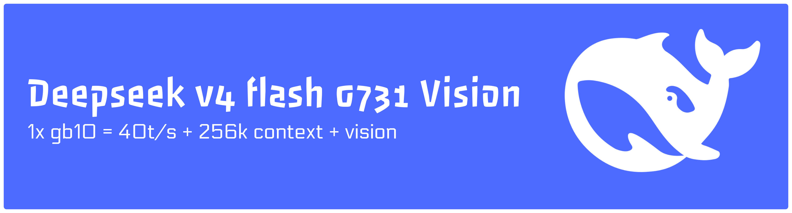

# deepseek-v4-flash-spark-vision

Adds image input to [`0xSero/deepseek-v4-flash-0731-spark`](https://huggingface.co/0xSero/deepseek-v4-flash-0731-spark)
on one NVIDIA DGX Spark. One vLLM server answers text and images at 262144
context.

Measurements and quality limits are on the
[model card](https://huggingface.co/Loke-60000/deepseek-v4-flash-0731-spark-vision-exp).

## What you need

The image holds the runtime. Weights are separate and you download them once.

| | From | Into | Size |
|---|---|---|---|
| Backbone | [`0xSero/deepseek-v4-flash-0731-spark`](https://huggingface.co/0xSero/deepseek-v4-flash-0731-spark) | `data/tp1/` | 98.8 GB |
| Tower | [`FlyCockpit/DeepSeek-V4-Flash-0731-vision`](https://huggingface.co/FlyCockpit/DeepSeek-V4-Flash-0731-vision) | `vision-assets/tower/` | 906 MB |
| Adapter | same repo, `merged-004800-5af0c5.pt` | `vision-assets/adapter/` | 41 MB |

## Run it

```bash
git clone https://github.com/Loke-60000/deepseek-v4-flash-spark-vision
cd deepseek-v4-flash-spark-vision

hf download 0xSero/deepseek-v4-flash-0731-spark --local-dir data/tp1
hf download FlyCockpit/DeepSeek-V4-Flash-0731-vision \
   deepencoder_v2_tower.safetensors --local-dir vision-assets/tower
hf download FlyCockpit/DeepSeek-V4-Flash-0731-vision \
   merged-004800-5af0c5.pt --local-dir vision-assets/adapter

./make_tp1_vision.sh data/tp1 data/tp1-vision
docker compose -f compose.vision.yaml up -d
```

The compose file pulls
`ghcr.io/loke-60000/deepseek-v4-flash-spark-vision:latest`, arm64, built for
GB10. Loading takes a few minutes. The server listens on port 8000.

To build the image yourself instead: `docker build -t local/dsv4-vision .`,
then point the compose `image:` at that tag.

## Send it an image

```bash
python3 probes/vision_img.py photo.jpg     # needs pillow
python3 probes/vision_test.py              # text, shapes and OCR probes
```

Any OpenAI client works. Pass `image_url` content parts holding a `data:` URI.

## Settings you should not change

`MODE: dspark`. With `MODE=off` the engine dies on `swa_k_cache page stride
37376 is smaller than DSV4 page width 37440`, which also happens on the plain
text model with no vision plugin loaded.

`MAX_MODEL_LEN: 262144`. The same crash appears at 16384.

`GPU_MEMORY_UTILIZATION: 0.945`. The tower takes about 0.9 GB out of the KV
budget, so at 0.93 the engine asks for 7.93 GiB of KV cache and finds 7.53.


## Licenses

Each upstream artifact keeps its own:
[`deepseek-ai/DeepSeek-V4-Flash-0731`](https://huggingface.co/deepseek-ai/DeepSeek-V4-Flash-0731)
for the backbone lineage, the FlyCockpit repository for the tower and adapter,
and [`moonshotai/Kimi-K2.6`](https://huggingface.co/moonshotai/Kimi-K2.6) for
the MoonViT weights the untested variant expects.
